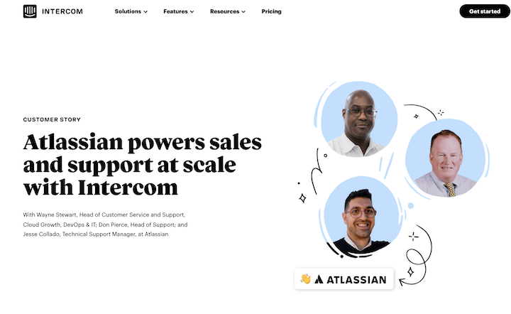
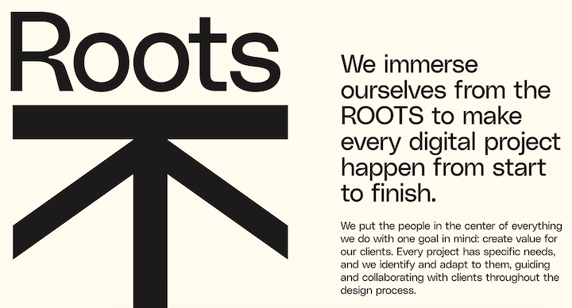
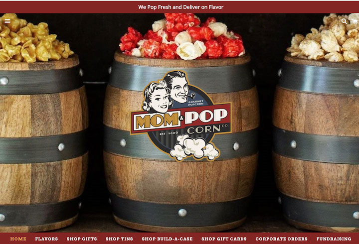
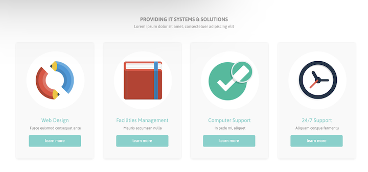
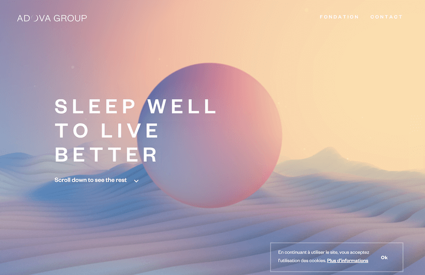
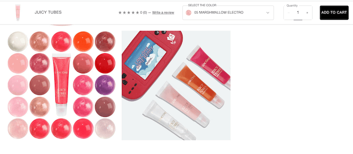
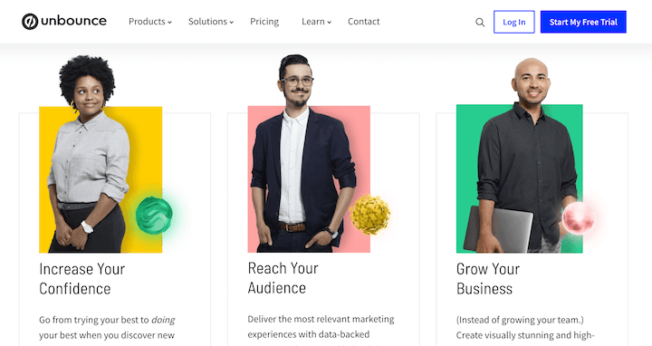
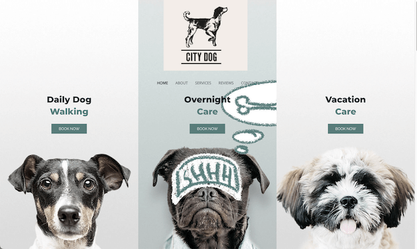
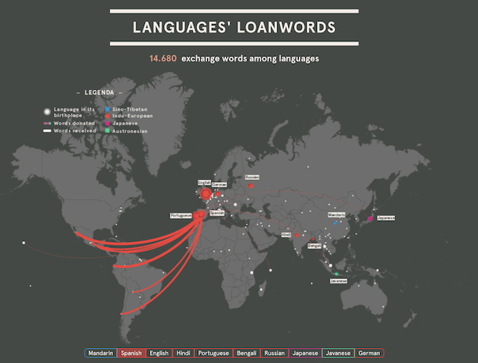

# 2022년 웹 디자인 트렌드

1. 일러스트 & 두들스 (Illustration & Doddles)
  
        
        웹 사이트에 화살표나 주름진 선과 같은 손으로 그린 삽화를 사용. 
        이러한 단순한 요소들은 움직임의 촉감과 친근감을 더해줌
---
2. 큰 타이포 그래피 & 컨템포러리 세리프 (Big Typography & Contemporary Serif)
  

        큰 타이포그랲: 키 메시징, 시각적 계층을 나누는데 도움, 단어가 그래픽 요소 자체가 되기도 함
---
3. 빈티지 디자인 (Vintage Design)
  

        옛 향수 자극, 긍정적인 감정 도출하고, 잠재 고객들과 감정적으로 연결함
---
4. 플랫아이콘 (Flat Icon)
  

        복잡한 쉐이딩 보다는 더 적은 색을 이용하고 단순한 모양을 사용
---
5. 복잡한 그라디언트 (Complex Gradients)
  

        플랫디자인 + 복잡한 그라디언트 > 플랫 아이콘의 심플함 보완
        화면 전체에 걸쳐 시각적 흥미를 유발하고 배경, CTA버튼 등
        어디에나 사용 (랜딩페이지 트렌드에도 해당)
---
6. 미묘한 모션 (Subtle Motion)
  

        배경, 버튼, 아이콘, 제목 등에 모션을 적용하여 방문자의 참여를 유도함 (Canvas사용)
---
7. 얼리오트 (Early Aughts)
  

        광택이 나는 이미지, 반짝이, 버블 폰트, 밝은 색상 등의 디자인 미학.
        원색 기반의 디자인 트렌드는 감정에 호소하고 고객을 끌어들이는데 큰 역할을 함
---
8. 포괄성 및 접근성 (Inclusivity & Accessibility)
  

        기업이 웹 사이트를 포함한 마케팅 에셋에 더 많은 포괄성과 접근성을 통합.
        이미지 포괄성을 고려할 대 보통 사람들을 생각함.
        배경과 설정으로 다른 소득과 생활 방식을 표현함.
        접근성 관련 모범 사례에 따라 계속 최적화 되는 중임
---
9.  그래픽과 일러스트레이션이 결합된 실제 이미지 
    (Real Images Combined with Graphics and Illustration)

    

          이미지를 돋보이게 하기 위해 일러스트와 그래픽을 오버레이하여
          장난스럽고 활동적인 느낌을 줌
---
10.   인터랙티브 콘텐츠 (Interactive Content)
  

          메인스트림이 인터렉티브 콘텐츠 도구에 대한 접근성이 높아짐에 따라
          장식적인 인터렉티브 요소들이 더욱 많아질 것.
          또한 데이터 시각화는 계속될 것